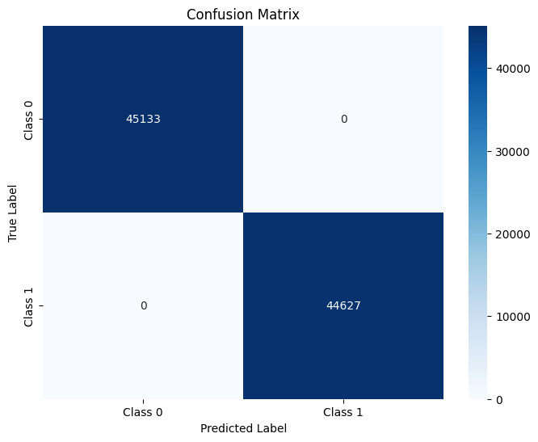

# 🔊 Wake Word Detection: "Hey Kocho"

## 📁 Portfolio Project

This project was developed as part of a portfolio to demonstrate advanced skills in:

- 🎧 Audio processing and data augmentation
- 🏗️ Developing suitable model architectures
- 🔄 Implementing Residual Blocks followed by LSTMs
- 🧠 Using TensorFlow and Keras for model building
- ⚙️ Utilizing callbacks for training optimization (e.g., EarlyStopping, ModelCheckpoint, ReduceLROnPlateau)
- 📊 Handling large datasets (448K+ samples)
- ⏱️ Training models over extended periods (72+ hours)

It showcases the ability to create a precise and robust model capable of differentiating between very similar sounding words.

## Overview

This project is a highly precise wake word detection system capable of distinguishing the wake word "Hey Kocho" from very similar sounding words like "Hey Couch" or "Hey Coach". This system was developed as a portfolio project to demonstrate advanced techniques in audio processing, data augmentation, and deep learning.

## Features

- **High Precision**: Detects "Hey Kocho" with minimal false positives.
- **Robustness**: Does not trigger on similar sounding words.
- **Large Dataset**: Trained on a dataset of 448,800 samples.
- **Advanced Model Architecture**: Utilizes Residual Blocks followed by LSTMs.
- **Extensive Training**: Model trained for over 72 hours.

## Table of Contents

- [🔊 Wake Word Detection: "Hey Kocho"](#-wake-word-detection-hey-kocho)
  - [📁 Portfolio Project](#-portfolio-project)
  - [Overview](#overview)
  - [Features](#features)
  - [Table of Contents](#table-of-contents)
  - [📚 Background](#-background)
  - [📊 Dataset](#-dataset)
  - [🎛️ Audio Preprocessing](#️-audio-preprocessing)
    - [🎵 Pitch Augmentation](#-pitch-augmentation)
    - [🔊 Volume Augmentation](#-volume-augmentation)
    - [📢 Noise Augmentation](#-noise-augmentation)
    - [🎶 Spectrogram Generation](#-spectrogram-generation)
  - [🏗️ Model Architecture](#️-model-architecture)
    - [Key Layers and Components:](#key-layers-and-components)
    - [Model Description:](#model-description)
    - [Detailed Model Structure:](#detailed-model-structure)
    - [Key Features :](#key-features-)
    - [Model Summary](#model-summary)
      - [🏛️ Architecture Summary](#️-architecture-summary)
  - [🏋️‍♂️ Training Process](#️️-training-process)
    - [Custom Data Generator](#custom-data-generator)
    - [Model Compilation](#model-compilation)
    - [Callbacks](#callbacks)
    - [Training Duration](#training-duration)
    - [Evaluation Metrics](#evaluation-metrics)
  - [📊 Results](#-results)
    - [Performance Metrics](#performance-metrics)
    - [Classification Report](#classification-report)
    - [Confusion Matrix](#confusion-matrix)
  - [⚠️ Important Note](#️-important-note)
  - [🔗 Dependencies](#-dependencies)
  - [💾 Installation](#-installation)
  - [🛠️ Usage](#️-usage)
  - [🫂 Contributing](#-contributing)
  - [📜 License](#-license)

## 📚 Background

Wake word detection is a crucial component in many voice-activated systems, enabling the system to remain in a low-power state until activated by a specific phrase. This project aims to push the boundaries of precision in wake word detection using advanced neural network architectures.

The wake word "Hey Kocho" is inspired by Shinobu Kocho from the anime-manga series Demon Slayer (Kimetsu no Yaiba). 🦋

<table>
  <tr>
    <td align="center">
      
      <br>
      <strong>Shinobu Kocho</strong>
    </td>
  </tr>
</table>

## 📊 Dataset

The dataset for this project was created and augmented to include 448,800 samples. This large dataset ensures the model is trained on a variety of voices and acoustic conditions.

The dataset consists of 2-second audio spectrograms.

In the current dataset, we used:

1. **"Wake word" class (1)**: 224,400 samples

   - 🗣️ Recording of the author saying the wake word.

2. **"Background" class (0)**: 224,400 samples

   - 🌳 **Background**: Recordings of the author's background.
   - 💬 **Talk**: Recording of the author speaking and talking about everything except the wake word.
   - 🏙️ **Urban**: [UrbanSound8K](https://www.kaggle.com/datasets/chrisfilo/urbansound8k?resource=download&select=fold5) Dataset from Kaggle.

The dataset was split as follows:

- Wake samples = 50% (224,400)
- Background samples = 50% (224,400)

In background samples:

- Urban samples (2 seconds) = 15,082
- Background samples = (Number of wake samples - Number of urban samples) / 2 = 104,659
- Talk samples = Background samples = 104,659

**Note** ⚠️: In the UrbanSound8K dataset, there were audio files of different durations, like 2 or 5 seconds. Therefore, we implemented a preprocessing function to extract each 2-second segment from all files.

**Important 🚧**: The model was trained only on the voice of the author. While the dataset includes various tones, moods, and acoustic conditions, it may not generalize well to other voices.

## 🎛️ Audio Preprocessing

In this project, detailed audio preprocessing steps were implemented to ensure high-quality input data. The following techniques were utilized:

### 🎵 Pitch Augmentation

Pitch augmentation was performed on the audio data to introduce variations in pitch. This technique helps in making the model more robust to different pitch levels. Pitch augmentation involved shifting the pitch of the audio in semitones using the `librosa.effects.pitch_shift` function.

### 🔊 Volume Augmentation

Volume augmentation was applied to the audio files to simulate variations in volume levels. This technique enhances the model's ability to generalize to different volume levels. Volume augmentation involved scaling the audio waveform by a factor using simple multiplication.

### 📢 Noise Augmentation

Noise augmentation was employed to introduce noise into the audio data, making the model more resilient to noisy environments. This technique adds random noise to the audio signal, simulating real-world scenarios. Gaussian white noise was generated and added to the audio waveform at various noise levels.

### 🎶 Spectrogram Generation

Spectrograms were generated from the audio data using Mel-frequency cepstral coefficients (MFCCs). Prior to spectrogram generation, a pre-emphasis filter was applied to the audio signal using the `librosa.effects.preemphasis` function. This filter boosts the higher frequencies, enhancing the signal-to-noise ratio and improving the overall quality of the spectrogram representation.

The generated spectrograms provide a visual representation of the audio signal's frequency content over time, which is essential for training deep learning models on audio data. Additionally, the spectrograms were normalized to ensure consistent input data for the model.

## 🏗️ Model Architecture

The model architecture for this wake word detection project is designed to effectively capture and enhance features from audio data, leveraging a combination of convolutional and recurrent neural network layers. This architecture ensures robust performance by learning both spatial and temporal dependencies in the input audio.

### Key Layers and Components:

- **CNN Layers**: Extract spatial features from spectrograms.
- **Residual Block Layers**: Enhance feature learning with skip connections, improving gradient flow and model performance.
- **Batch Normalization**: Normalize the inputs of each layer, speeding up training and improving stability.
- **Dropout**: Prevent overfitting by randomly dropping units during training.
- **LSTM (Long Short-Term Memory)**: Capture long-term dependencies and temporal patterns in the audio signals.
- **TimeDistributed**: Apply a layer to every temporal slice of an input.
- **Dense Layers**: Perform final classification.

### Model Description:

The model is built with the following structure, emphasizing the use of residual blocks and LSTM layers to effectively process audio data.

### Detailed Model Structure:

```python
def residual_block(x, filters:int, kernel_size:int|Tuple[int]=3, strides:int|Tuple[int]=1, activation:str="relu",padding:str="same" ):
    y = layers.Conv2D(filters=filters, kernel_size=kernel_size, strides=strides, padding=padding)(x)
    y = layers.BatchNormalization()(y)
    y = layers.Activation(activation)(y)
    y = layers.Conv2D(filters=filters, kernel_size=kernel_size, strides=1, padding=padding)(y)
    y = layers.BatchNormalization()(y)

    if x.shape[-1] != filters:
        # Use pointwise convolution to manipulate filter number without changing dimenstions of spatial data
        x = layers.Conv2D(filters=filters, kernel_size=1, strides=strides, padding=padding)(x)

    out = layers.Add()([x, y]) # Skip Connection
    out = layers.Activation(activation)(out)
    return out


def build_model(input_shape, batch_size=32):
    inputs = Input(shape=input_shape, batch_size=batch_size)

    x = layers.Conv2D(filters=32, kernel_size=3, padding="same")(inputs)
    x = layers.BatchNormalization()(x)
    x = layers.Activation("relu")(x)
    x = layers.MaxPooling2D(pool_size=2)(x)

    x = residual_block(x, filters=64)
    x = residual_block(x, filters=128)
    x = residual_block(x, filters=256, strides=2)
    x = residual_block(x, filters=512, strides=2)

    x = layers.TimeDistributed(layers.Flatten())(x)
    x = layers.Dropout(0.3)(x)

    x = layers.LSTM(units=256, return_sequences=True, kernel_regularizer=regularizers.l2(0.001))(x)
    x = layers.Dropout(0.3)(x)

    x = layers.LSTM(units=512, return_sequences=True, kernel_regularizer=regularizers.l2(0.001))(x)
    x = layers.Dropout(0.3)(x)
    x = layers.LSTM(units=512, kernel_regularizer=regularizers.l2(0.001))(x)
    x = layers.Dropout(0.3)(x)

    x = layers.Dense(units=128, activation="relu")(x)
    x = layers.Dropout(0.3)(x)

    outputs = layers.Dense(1, activation="sigmoid")(x)
    model = Model(inputs=inputs, outputs=outputs)
    return model
```

### Key Features :

- **Residual Blocks**: Capture and enhance features from the input audio using skip connections, which help in maintaining gradient flow and improving model training.
- **Double LSTMs**: Capture temporal dependencies in the audio signals, ensuring the model can learn from the sequence of sounds.
- **Batch Normalization and Dropout**: Ensure robust training and reduce overfitting by normalizing layer inputs and randomly dropping units during training.
- **TimeDistributed Layer**: Apply layers to each time step individually, maintaining the temporal structure of the data.

This model architecture effectively combines the strengths of CNNs for feature extraction and LSTMs for sequence learning, making it well-suited for the task of wake word detection.

### Model Summary

```text
Total params: 20,422,657
Trainable params: 20,418,753
Non-trainable params: 3,904
__________________________________________________________________________________________________
```

```text
X_batch shape: (32, 40, 173, 1)
y_batch shape: (32,)

Single Input shape:  (40, 173, 1)
```

#### 🏛️ Architecture Summary

<details>
  <summary>Model Summary</summary>

```text
Model: "model"
__________________________________________________________________________________________________
Layer (type)                   Output Shape         Param #     Connected to
==================================================================================================
input_1 (InputLayer)           [(32, 40, 173, 1)]   0           []

conv2d (Conv2D)                (32, 40, 173, 32)    320         ['input_1[0][0]']

batch_normalization (BatchNorm  (32, 40, 173, 32)   128         ['conv2d[0][0]']
alization)

activation (Activation)        (32, 40, 173, 32)    0           ['batch_normalization[0][0]']

max_pooling2d (MaxPooling2D)   (32, 20, 86, 32)     0           ['activation[0][0]']

conv2d_1 (Conv2D)              (32, 20, 86, 64)     18496       ['max_pooling2d[0][0]']

batch_normalization_1 (BatchNo  (32, 20, 86, 64)    256         ['conv2d_1[0][0]']
rmalization)

activation_1 (Activation)      (32, 20, 86, 64)     0           ['batch_normalization_1[0][0]']

conv2d_2 (Conv2D)              (32, 20, 86, 64)     36928       ['activation_1[0][0]']

conv2d_3 (Conv2D)              (32, 20, 86, 64)     2112        ['max_pooling2d[0][0]']

batch_normalization_2 (BatchNo  (32, 20, 86, 64)    256         ['conv2d_2[0][0]']
rmalization)

add (Add)                      (32, 20, 86, 64)     0           ['conv2d_3[0][0]',
                                                                  'batch_normalization_2[0][0]']

activation_2 (Activation)      (32, 20, 86, 64)     0           ['add[0][0]']

conv2d_4 (Conv2D)              (32, 20, 86, 128)    73856       ['activation_2[0][0]']

batch_normalization_3 (BatchNo  (32, 20, 86, 128)   512         ['conv2d_4[0][0]']
rmalization)

activation_3 (Activation)      (32, 20, 86, 128)    0           ['batch_normalization_3[0][0]']

conv2d_5 (Conv2D)              (32, 20, 86, 128)    147584      ['activation_3[0][0]']

conv2d_6 (Conv2D)              (32, 20, 86, 128)    8320        ['activation_2[0][0]']

batch_normalization_4 (BatchNo  (32, 20, 86, 128)   512         ['conv2d_5[0][0]']
rmalization)

add_1 (Add)                    (32, 20, 86, 128)    0           ['conv2d_6[0][0]',
                                                                  'batch_normalization_4[0][0]']

activation_4 (Activation)      (32, 20, 86, 128)    0           ['add_1[0][0]']

conv2d_7 (Conv2D)              (32, 10, 43, 256)    295168      ['activation_4[0][0]']

batch_normalization_5 (BatchNo  (32, 10, 43, 256)   1024        ['conv2d_7[0][0]']
rmalization)

activation_5 (Activation)      (32, 10, 43, 256)    0           ['batch_normalization_5[0][0]']

conv2d_8 (Conv2D)              (32, 10, 43, 256)    590080      ['activation_5[0][0]']

conv2d_9 (Conv2D)              (32, 10, 43, 256)    33024       ['activation_4[0][0]']

batch_normalization_6 (BatchNo  (32, 10, 43, 256)   1024        ['conv2d_8[0][0]']
rmalization)

add_2 (Add)                    (32, 10, 43, 256)    0           ['conv2d_9[0][0]',
                                                                  'batch_normalization_6[0][0]']

activation_6 (Activation)      (32, 10, 43, 256)    0           ['add_2[0][0]']

conv2d_10 (Conv2D)             (32, 5, 22, 512)     1180160     ['activation_6[0][0]']

batch_normalization_7 (BatchNo  (32, 5, 22, 512)    2048        ['conv2d_10[0][0]']
rmalization)

activation_7 (Activation)      (32, 5, 22, 512)     0           ['batch_normalization_7[0][0]']

conv2d_11 (Conv2D)             (32, 5, 22, 512)     2359808     ['activation_7[0][0]']

conv2d_12 (Conv2D)             (32, 5, 22, 512)     131584      ['activation_6[0][0]']

batch_normalization_8 (BatchNo  (32, 5, 22, 512)    2048        ['conv2d_11[0][0]']
rmalization)

add_3 (Add)                    (32, 5, 22, 512)     0           ['conv2d_12[0][0]',
                                                                  'batch_normalization_8[0][0]']

activation_8 (Activation)      (32, 5, 22, 512)     0           ['add_3[0][0]']

time_distributed (TimeDistribu  (32, 5, 11264)      0           ['activation_8[0][0]']
ted)

dropout (Dropout)              (32, 5, 11264)       0           ['time_distributed[0][0]']

lstm (LSTM)                    (32, 5, 256)         11797504    ['dropout[0][0]']

dropout_1 (Dropout)            (32, 5, 256)         0           ['lstm[0][0]']

lstm_1 (LSTM)                  (32, 5, 512)         1574912     ['dropout_1[0][0]']

dropout_2 (Dropout)            (32, 5, 512)         0           ['lstm_1[0][0]']

lstm_2 (LSTM)                  (32, 512)            2099200     ['dropout_2[0][0]']

dropout_3 (Dropout)            (32, 512)            0           ['lstm_2[0][0]']

dense (Dense)                  (32, 128)            65664       ['dropout_3[0][0]']

dropout_4 (Dropout)            (32, 128)            0           ['dense[0][0]']

dense_1 (Dense)                (32, 1)              129         ['dropout_4[0][0]']

==================================================================================================
```

</details>

## 🏋️‍♂️ Training Process

The training process of the model was designed to maximize performance while handling a large dataset and extended training duration. Below are the key aspects of the training setup:

### Custom Data Generator

- **Custom Generator**: For efficient data handling, we used a custom-made generator defined in `KerasGenerator.py`. This generator, `SpectrogramGenerator`, was implemented using `keras.utils.Sequence` to yield batches of spectrogram data during training.

**Validation Split**: 20% of the dataset was used for validation.

### Model Compilation

The model was compiled with the following parameters:

```python
model.compile(
    loss="binary_crossentropy",
    optimizer=optimizers.SGD(learning_rate=learning_rate, momentum=0.9, nesterov=True),
    metrics=["accuracy"],
)
```

- **Loss Function**: Binary Cross-Entropy
- **Optimizer**: SGD with Nesterov momentum
- **Learning Rate**: At the beginning of training was set to 1e-3 (0.001)
- **Metrics**: Accuracy

### Callbacks

To enhance training efficiency and performance, several callbacks were employed:

```python
early_stopping_callback = callbacks.EarlyStopping(
    monitor="val_loss", mode="min", patience=15, restore_best_weights=True, verbose=1
)
checkpoint_callback = callbacks.ModelCheckpoint(
    "best_model.h5", monitor="val_loss", mode="min", save_best_only=True, verbose=1
)
reduce_lr_callback = callbacks.ReduceLROnPlateau(
    monitor="val_loss", mode="min", factor=0.5, patience=2, min_lr=1e-7, verbose=1
)
```

- **Early Stopping**: Monitors `val_loss`, stops training if no improvement is observed for 15 epochs, and restores the best weights.
- **Model Checkpoint**: Saves the model with the best `val_loss` during training to `best_model.h5`.
- **Reduce LR on Plateau**: Reduces the learning rate by a factor of 0.5 if `val_loss` does not improve for 2 consecutive epochs, with a minimum learning rate of `1e-7`.

### Training Duration

- **Duration**: The model was trained over an extensive period of 72+ hours to ensure convergence and optimal performance.

### Evaluation Metrics

- **Metrics Used**: During training, the primary metric monitored was accuracy.

## 📊 Results

The trained wake word detection model achieved outstanding results across various evaluation metrics, demonstrating its high accuracy and reliability in distinguishing between the wake word "Hey Kocho" and other sounds.

### Performance Metrics

- **Precision**: 1.0
- **Recall**: 1.0
- **F1 Score**: 1.0

### Classification Report

The detailed classification report provides a comprehensive view of the model's performance on each class:

| Class          | Precision | Recall | F1-Score | Support |
| -------------- | --------- | ------ | -------- | ------- |
| 0 (Background) | 1.00      | 1.00   | 1.00     | 45,133  |
| 1 (Wake Word)  | 1.00      | 1.00   | 1.00     | 44,627  |

| Metric       | Value |
| ------------ | ----- |
| Accuracy     | 1.00  |
| Macro Avg    | 1.00  |
| Weighted Avg | 1.00  |

The metrics indicate perfect performance in detecting both the background noise and the wake word, resulting in a balanced and accurate model.

### Confusion Matrix

The confusion matrix further visualizes the model's performance by showing the true positive, true negative, false positive, and false negative predictions.



The confusion matrix reinforces the classification report's findings, with no misclassifications observed, highlighting the model's precision and recall in both classes.

## ⚠️ Important Note

The model is trained only on the voice of the author. It may not perform optimally with other voices and should be fine-tuned with additional data for broader usage.

## 🔗 Dependencies

The link to the **PreTrained Model** (on voice of the author): [PreTrained Model](https://drive.google.com/file/d/1KZUPgDyXOAIEerHWMrxwh7Fb50Yxf0RT/view?usp=sharing)

To run this project, you need to have the following dependencies installed:

- 🐍 [Python - 3.10.13](https://www.python.org/downloads/): Python is a programming language used by this project.
- 📦 [pip](https://pip.pypa.io/en/stable/): A package manager for installing Python libraries and packages.
- 🧠 [TensorFlow = 2.10.1](https://www.tensorflow.org/): An open-source machine learning framework used for building and training the model.
- 🔢 [NumPy - 1.25.2](https://numpy.org/): A library for numerical computing in Python, used for handling arrays and data.
- 📈 [Matplotlib - 3.8.0](https://matplotlib.org/): A plotting library for creating visualizations from data.
- 📊 [Seaborn - 0.13.1](https://seaborn.pydata.org/): A Python data visualization library based on Matplotlib, used for statistical graphics.
- 🎵 [Librosa - 0.10.1](https://librosa.org/): A Python package for music and audio analysis, used for audio processing tasks.
- 🔊 [Soundfile - 0.12.1](https://pysoundfile.readthedocs.io/en/latest/): A Python library for reading and writing sound files.
- 🎮 [Pygame - 2.5.2](https://www.pygame.org/): Used for playing sounds.
- 🎤 [PyAudio - 0.2.13](https://people.csail.mit.edu/hubert/pyaudio/): Python bindings for PortAudio, used for audio input and output.

These libraries provide the necessary tools for building, training, and evaluating the model, as well as handling audio input and output, and visualizing the results.

Here's the refined and updated installation and usage section:

## 💾 Installation

1. **Set up a virtual environment**:

   It's recommended to create a virtual environment to manage dependencies for this project. You can do this using `venv` or `conda`.

   Using `conda`:

   ```bash
     conda create -n my_env
     conda activate my_env
   ```

   Using `pip`

   ```bash
     virtualvenv my_env

     # On windows:
     my_env/Scripts/activate

     # On Linux:
     source my_env/bin/activate
   ```

2. **Clone the repository**:

   ```bash
   git clone https://github.com/giyu_51/wake-word-detection
   cd wake-word-detection
   ```

3. **Install dependencies**:

   Use pip to install the required Python packages listed in `requirements.txt`:

   ```bash
   pip install -r requirements.txt
   ```

Refer to [`Usage` section](#usage)

## 🛠️ Usage

📖 Which script to use? :

1. You can use the script `main.py` which allows making predictions from audio files or directly using the voice recorder. However, this method is not recommended for project integration due to the following reasons:

   - Importing Modules
   - Loading Model (at each prediction)
   - Model without warm-up batch will be slow at first predictions

   For optimized performance and project integration, it's recommended to use `WakeWord.py`. This system is optimized for continuous recording and prediction, making it much faster and suitable for project integration. Feel free to modify the file as needed; the code is straightforward.

2. Still, if the purpose is solely one-time use or testing, here is an example of `main.py` utilization through the command line:
   - Using Audio file (`--audio` - loads .wav format only):
     ```bash
     python main.py --audio my_file.wav
     ```
   - Using voice recorder (`--use_recorder` - by default is false):
     ```bash
     python main.py --use_recorder
     ```
   - Specifying the model path (`--model_path`) - by default, the model name is `model.keras`:
     ```bash
     python main.py --use_recorder --model_path "best_model.h5"
     ```

## 🫂 Contributing

Contributions are welcome! Please follow these steps to contribute:

1. Fork the repository.
2. Create a new branch (`git checkout -b feature-branch`).
3. Make your changes.
4. Commit your changes (`git commit -m 'Add some feature'`).
5. Push to the branch (`git push origin feature-branch`).
6. Open a pull request.

## 📜 License

This project is licensed under the MIT License - see the [LICENSE](LICENSE) file for details.
